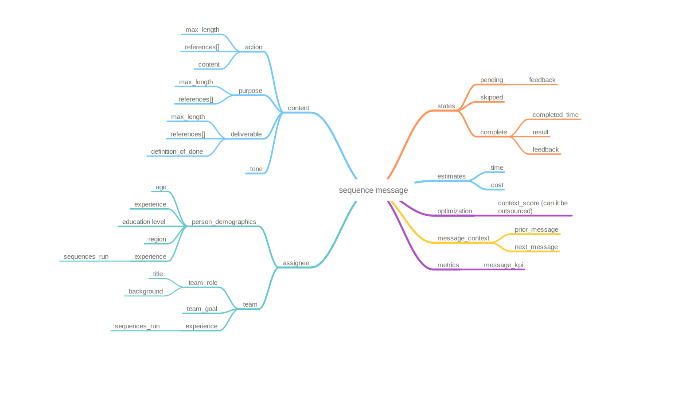

# Message Object Specification

OpenSequence is an open specification for defining sequential workflow messages. This specification enables standardized communication and execution of workflow steps while maintaining flexibility for various implementations. Each message represents a discrete step within a larger sequence, with clear state transitions, accountability, and measurable outcomes.



## Core Components

### `action` (Required)
- **Description**: Defines the specific action to be taken.
- **Purpose**: Provides clarity on the task or initiative being communicated.
- **Constraints**: Must be present in every message.
- **Example**:
    ```yaml
    action: 
      content: "Update the API endpoint to support pagination"
      max_length: 200
      references: 
        - "API-123"
        - "DOC-456"
    ```

### `state`
- **Description**: Current state of the message in its lifecycle.
- **Purpose**: Tracks progress and status of the message.
- **Valid States**:
    - `pending`: Initial state for new messages
    - `skipped`: Message has been bypassed
    - `complete`: Message has been fulfilled
- **State Properties**:
  ```yaml
  state:
    current: "pending"
    feedback: "Awaiting resource allocation"
    completed_time: "2024-01-28T15:30:00Z"  # Only for complete state
    result: "success"                        # Only for complete state
  ```
- **Valid State Transitions**:
    1. `pending → complete`
        - Requires: completed_time, result
        - Optional: feedback
    2. `pending → skipped`
        - Requires: feedback
    3. `skipped → pending`
        - Requires: feedback
    4. `complete → pending`
        - Requires: feedback
        - Note: Only allowed if result was "failed"

### `estimates`
- **Description**: Projected resource requirements.
- **Purpose**: Aids in resource allocation and planning.
- **Example**:
    ```yaml
    estimates:
      time: "PT4H"    # ISO 8601 duration format
      cost: 500.00    # Decimal number
    ```

### `optimization`
- **Description**: Scoring and optimization parameters.
- **Purpose**: Helps determine message handling strategy.
- **Example**:
    ```yaml
    optimization:
      context_score: 0.85  # Float between 0 and 1
    ```

### `message_context`
- **Description**: Contextual relationships with other messages.
- **Purpose**: Establishes message position in sequence.
- **Example**:
    ```yaml
    message_context:
      prior_message_id: "msg-123"
      next_message_id: "msg-456"
    ```

### `metrics`
- **Description**: Performance indicators for the message.
- **Purpose**: Enables measurement and optimization.
- **Example**:
    ```yaml
    metrics:
      message_kpi: 95.5
    ```

### `assignee`
- **Description**: Assignment and responsibility information.
- **Purpose**: Defines ownership and team context.
- **Example**:
    ```yaml
    assignee:
      id: "user-789"
      team:
        role: "developer"
        goal: "Sprint completion"
      experience:
        sequences_run: 42
    ```

### `content`
- **Description**: Detailed message content and requirements.
- **Purpose**: Provides comprehensive task information.
- **Example**:
    ```yaml
    content:
      action:          # Required
        content: "Implement user authentication"
        max_length: 200
        references: ["AUTH-123"]
      purpose:         # Optional
        content: "Secure application access"
        max_length: 100
      deliverable:     # Optional
        content: "Working JWT authentication"
        max_length: 150
        definition_of_done: ["Tests passing", "Documentation updated"]
      tone: "technical"
    ```

## Data Types

- **Strings**: UTF-8 encoded
- **Numbers**: 64-bit floating point
- **Timestamps**: ISO 8601 format
- **Durations**: ISO 8601 duration format
- **Arrays**: Zero or more elements
- **Objects**: Key-value pairs

## Best Practices

1. **Message Identifiers**
    - Use unique, URL-safe identifiers
    - Prefix with `msg-` for clarity
    - Example: `msg-a1b2c3d4`

2. **State Changes**
    - Always include feedback when changing states
    - Use ISO 8601 timestamps for all time-related fields
    - Validate state transitions against defined rules

3. **References**
    - Use consistent reference formats across messages
    - Document external reference systems
    - Maintain referential integrity

4. **Content Lengths**
    - Define max_length in characters
    - Consider UTF-8 encoding implications
    - Allow configuration per implementation

## Error Handling

1. **Invalid State Transitions**
   ```yaml
   error:
     code: "invalid_transition"
     message: "Cannot transition from complete to skipped"
     details:
       current_state: "complete"
       requested_state: "skipped"
   ```

2. **Missing Required Fields**
   ```yaml
   error:
     code: "missing_required"
     message: "Action is required"
     details:
       field: "action"
   ```

## Schema Evolution

- Maintain backward compatibility
- Use semantic versioning for schema changes
- Document deprecated fields
- Provide migration guides for breaking changes